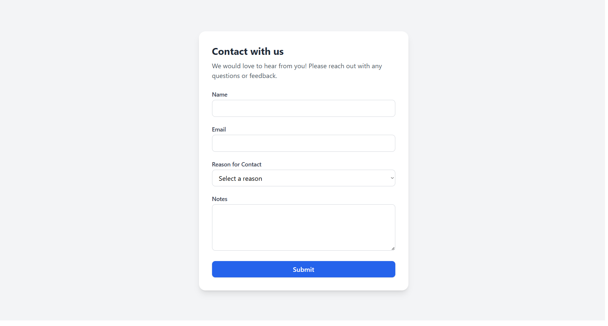
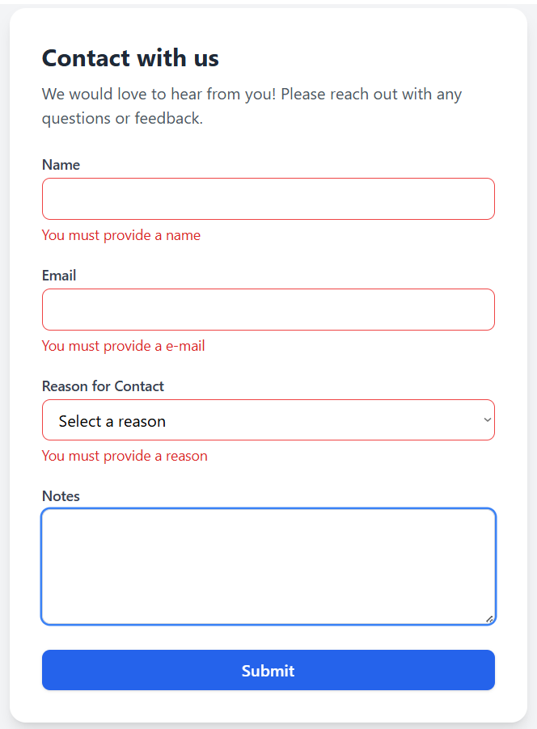
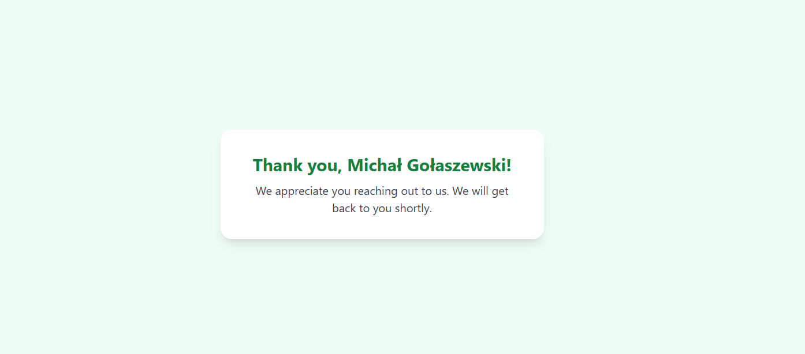

# React Tailwind Contact Form

A simple and responsive contact form built with **React**, **TailwindCSS 3.4**, **React Hook Form**, and **React Router**.  
The app validates user inputs, displays clear error messages, and shows a thank you page after successful submission.

---

## ✨ Features
- **Responsive Design:** Fully responsive layout using TailwindCSS 3.4.
- **Client-side Validation:** Form validation powered by React Hook Form.
- **Custom Error Messages:** Clear and specific error messages for each input field.
- **Thank You Page:** Users are navigated to a personalized thank you page upon submission.
- **Modern UI:** Clean, minimalistic, and professional look.
- **React Router Integration:** Seamless page navigation within a single-page application.

---

## 📦 Technologies Used
- **React** - Frontend library for building UI components.
- **TailwindCSS 3.4** - Utility-first CSS framework for styling.
- **React Hook Form** - Library for handling form state and validation.
- **React Router** - Declarative routing for React applications.

---

## 📸 Screenshots

### Contact Page (clean)

### Contact Page (with errors)

### Thank You Page

---

## 📄 License
MIT License